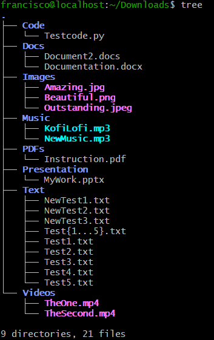
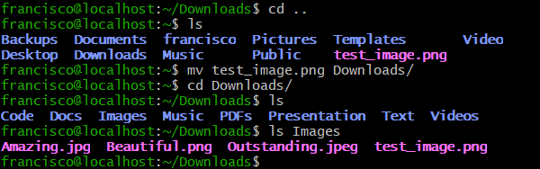

# Dlorg_Francisco_Wainstein
Working with Dlorg Lab

## First Line from inside VM Dlorg directory
This is my first message to test it works, and with this, the first official commit.

## gitignore file

A file was created called vim.gitignore to ignore vim related stuff when committing to the repository

# Bash script

Created a bash script file called dlorg.
checked and gave new permissions to file using ls -l and chmod

```bash

ls -l dlorg

chmod +x dlorg

```
# Dlorg script

The script created has the purpose of creating (if not already created) folders for specific type of files, and then check existing files inside the directory if they has one of the suffixes listed in the script. If they do, then they are moved to their respective folders for better file management.

For the script to work one needs atleast a second terminal to use the following command;
```
./dlorg
```
Inside the repository directory, and the other terminal in the Downloads directory. So first you create the files using touch, and after they are created, execute the command.


# Dlorg Update script

Created a second script to watch the first, and execute it when a new file is added to the Downloads directory in home.

While the script is being executed, any and all files that comes into the Downloads directory gets sorted.

For example using mv to move an image file from home to Downloads and it went straight to the Images folder.




# Moving file from host computer into VM

An image file was moved from host computer to the virtual machine using the following command;

```bash

scp file/path/for/file.suffix VMUser@IP:Folder/destination/

```




# Case Handle: Folder deleted

In case a folder and its content was deleted, and a new file is created, while the script is working, it will automatically run the first script and create a folder like the one deleted. As it has -p means that if it already exists it does not create one, and therefore we avoid any problems with execution. The script then runs as regular and identifies the new file to move it to its corresponding folder.


# Service

Created a service out of the second script so that when the session starts, and new files comes in to the Downloads folder, they get sorted right away.

For the service to work, you must first create the folder in .config system

```bash

mkdir -p ~/.config/systemd/user

```

and then use vim to create the service file

```bash

vim ~/.config/systemd/user/dlorg.service
```
Edit the service file so that it executes the script on session start and that it starts working once enabled

Service enabled using;

```bash

systemctl --user daemon-reload
systemctl --user enable --now dlorg.service

```

the --now is for it to work directly and the reload makes the system read the file again.

# Dlorg repository

The Dlorg lab repository is a local git inside the VM machine where the lab is worked on, connected to github via cloning the repository.

To clone the repository, the following was needed:

- A copy of the ssh-link from the github repository
- Inside the VM, go into the destination folder, in this case github folder
- git clone #Github-Repository-SSH-Link

# Current state

Dlorg has now become a working repository with two dlorg scripts and a service.

1 - Dlorg script, the first script created that targets Download folder and creates the sought after folders {ex. Images, Docs, Text, Presentation, Music, Videos..} and uses a case to compare the suffix or extension of files. If any file contains an extension listed to be moved to a specific folder, the script moves said file to folder.

The first script required the following command to execute;
```bash
./dlorg
```

2 - Dlorg-update script, the second script used inotifywait to, when executed, watch what new files appear in the Downdloads directory and run the dlorg script to sort them out.

The second script required the following command to execute;

```bash
./dlorg-update
```
and stayed watching until stopped with " Ctrl + C "

3 - Dlorg service, to automatize the scripts and make them work without the need to manually execute them, a service was created and needed a systemlink to execute the service and have it enabled

Once created the service, the link was made using systemctl --user (daemon-reload and enable #service)


